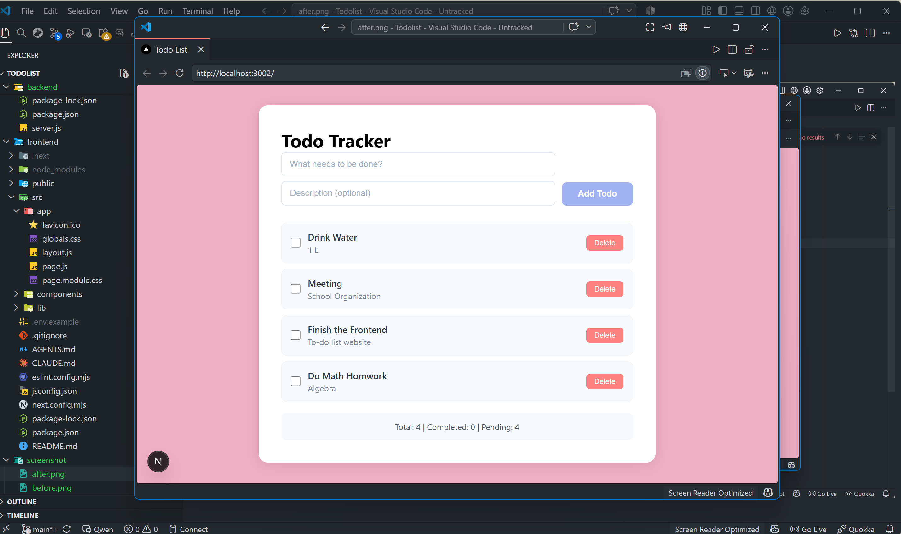
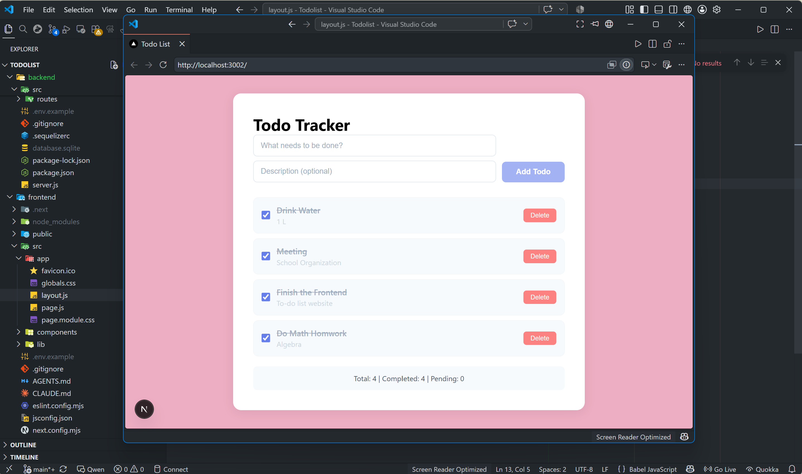

# Todo Tracker App
Todo application consisting of a RESTful Express API backend and a Next.js frontend. The backend manages CRUD operations and persists data using SQLite, while the frontend provides a responsive interface for interacting with todos.

## Preview
**Before**

**After**

## Features

- Create, read, update, and delete todos
- Mark todos as complete/incomplete
- Persistent storage with SQLite
- Input validation and error handling
- Clean, minimal UI

## Tech Stack

### Backend
- **Node.js** with Express.js
- **Sequelize** ORM with SQLite
- **Custom middleware** for validation
- **CORS** enabled for frontend communication
#### How to Run
1. cd backend (Terminal 1)
2. npm install
3. cp .env.example .env (PORT=3001 NODE_ENV=development)
4. npx sequelize-cli db:migrate
5. npm run dev

### Frontend
- **Next.js** with App Router
- **Plain CSS** for styling
- **Axios** for API calls
- **React Hooks** (useState, useEffect)
#### How to Run
1. cd frontend (Terminal 2)
2. npm install
3. cp .env.example .env (NEXT_PUBLIC_API_URL=http://localhost:3001)
4. npm run dev

## API Endpoints

| Method | Endpoint | Description |
|--------|----------|-------------|
| GET | `/todos` | Get all todos |
| POST | `/todos` | Create a new todo |
| PUT | `/todos/:id` | Update a todo (completed status) |
| DELETE | `/todos/:id` | Delete a todo |

## Design Decisions
Throughout the development process, I applied several approaches and technologies to keep the code clean, maintainable, and aligned with the project's needs. Here are some of the design decisions I made:

### Backend
**1. Modular Structure**
The backend follows a modular architecture by separating models, controllers, routes, middleware, configuration, and migrations into dedicated folders. This separation of concerns improves maintainability, makes the codebase easier to navigate, and allows features to be extended without affecting unrelated components

**2. CORS**
Since the frontend and backend run on different origins during development (localhost:3000 and localhost:3001), CORS is enabled to allow cross-origin API requests. In production, this would be restricted to trusted domains.

### Frontend
**1. JavaScript**
I chose JavaScript to keep both the frontend and backend consistent, reducing complexity for this project. While I have experience with TypeScript, JavaScript was sufficient for the project's scope.

**2. Axios**
Axios provides a clean API for making HTTP requests and handling asynchronous operations. I chose it because of its straightforward syntax, automatic JSON handling, and consistent error management.

**3. Local State**
In this app, we need to store todo data and errors. In React, there are two common approaches: useState (for local state) and Context API (for global state). The todo data and errors are only used on the main page (page.js). Child components only receive props and send events back to the parent. I went with useState because the state is local and only used in one place. Context API is better suited for state that's used across many components.

## Known Issue
- React warns about calling setState inside useEffect. In this project the behavior is intentional and does not affect functionality, although alternative patterns could be considered in larger applications.

## Possible Improvements
**Edit Title & Description:** Right now, once a todo is created, you can't change the title or description. Going forward, it would be nice to add an edit feature so users can update the title or description anytime.
**Better State Management:** This is to address the issue that we have in frontend. The project currently uses useState and prop drilling for state management. For a complex app or app with a lot of features, it might be worth considering Context API or Zustand so state management is cleaner, including handling errors and loading states across different components.

